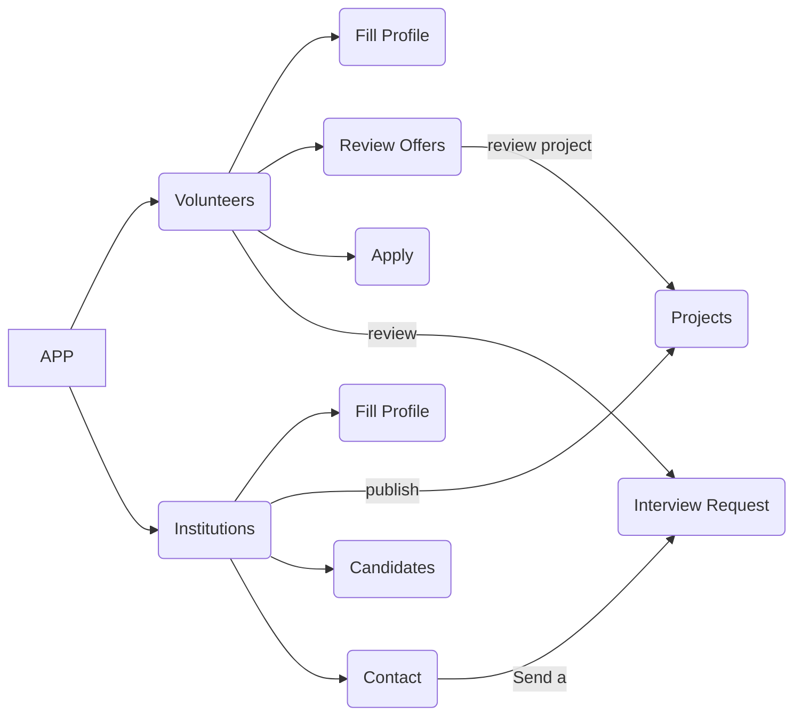

```mermaid
graph LR
    A[APP] --> B(Volunteers)
    A[APP] --> C(Institutions)
    B --> D(Fill Profile)
    B --> E(Review Offers)
    B --> F(Apply)
    B -- review --> K(Interview Request)
    C --> G(Fill Profile)
    C -- publish --> H(Projects)
    C --> I(Candidates)
    C --> J(Contact)

    J -- Send a --> K
    E -- review project--> H
```
